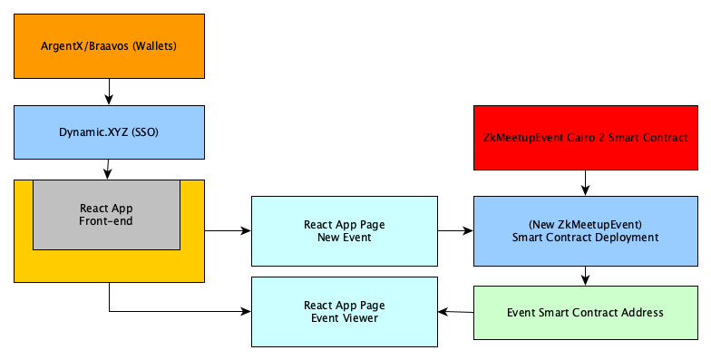
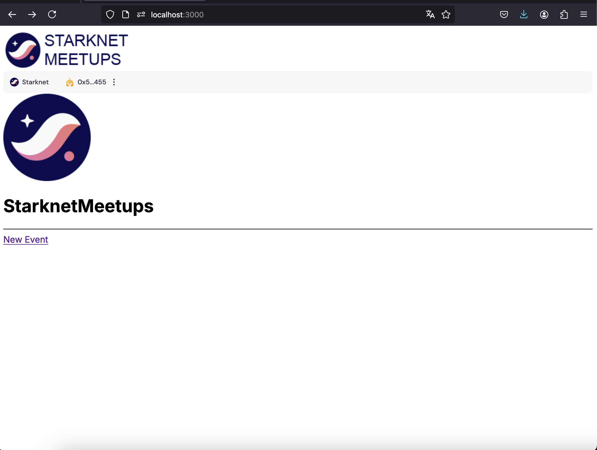

  

StarknetMeetups
---

StarknetMeetups is a application leveraging StarkNet’s blockchain for decentralized, secure event management. With on-chain storage, it ensures transparent and immutable records of event details, participant interactions, and transactions. Users benefit from enhanced privacy, reduced fraud risk, and seamless coordination for meetups and gatherings.

### Features

- [X] Cairo 2.0 Smart Contract 
- [X] React.js Frontend with Dynamic XYZ auth (Argent/Bravoo SSO)
- [] Frontend application form for new events (Deployment & Declaration of Smart Contract)
- [] Frontend viewer for events with RSVP options

### Tech stack

**Starknet**: Starknet provides the core blockchain infrastructure and Cairo smart contract solution.

**Dynamic**: Dynamic.xyz provides the authentication framework for Web3 wallets.

### License
MIT
